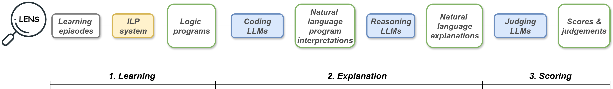

# LENS: Logic Programming Explanation via Neural Summarisation

This is the repository for the paper "Ultra Strong Machine Learning: Teaching Humans Active Learning Strategies via Automated AI Explanations".

## Overview


LENS (Logic Programming Explanation via Neural Summarisation) is a neuro-symbolic method that combines curriculum-trained Inductive Logic Programming (ILP) with Large Language Models, to automates learning and explanation of logic programs in natural language. LENS addresses a key limitation of prior Ultra Strong Machine Learning (USML) approaches by replacing hand-crafted explanation templates with scalable automated generation. To investigate whether LENS can teach transferable active learning strategies, we carried out a human learning experiment across three related domains. 

### Key Features

- **Multi-Model Support**: Unified API for multiple LLM providers (DeepSeek, Anthropic, OpenAI, Ollama) using LiteLLM
- **Experimental Conditions**: Compare different explanation strategies (LENS vs baseline, with/without context)
- **Automated Workflows**: Automated pipelines with learning and explaining logic programs
- **Domain Generalisability**: Tested across circuit analysis, and two other domains

## Framework Architecture

LENS follows a systematic three main pipelines:

1. **Logic Program Synthesis**: Learn Prolog programs using episode-based ILP with Hopper/Popper
2. **Explanation generation**: Interpret learned Prolog programs using coding models and generate natural language explanations with reasoning models
4. **Response Scoring**: Evaluate explanation quality using multiple critic models

### Framework Components
<details> 
- `src/pipelines.py` - Core pipeline implementations with multi-model support
- `src/task_factory.py` - Task creation and validation
- `src/workflow.py` - Workflow configuration and execution
- `src/tasks.py` - Basic data management between pipelines
- `examples/` - Usage examples and sample results
- `scripts/` - Domain-specific evaluation scripts
</details>

### ILP Learning Pipeline
<details>
The ILP component uses episode learning to progressively build complex logic programs:

```python
# Example ILP learning episodes for circuit analysis domain
ilp_learning_episodes = [
    {
        "name": "exclusively_powers",           
        "kb_path": "programs/circuit/exclusively_powers",
        "depends_on": null,                     # Foundation episode
        "max_ho": 3, "max_rules": 3
    },
    {
        "name": "partition", 
        "kb_path": "programs/circuit/partition",
        "depends_on": "exclusively_powers",     # Builds on previous
        "negation": true,                       # Uses negative examples
        "max_ho": 3, "max_rules": 3
    },
    ...
    ,
    {
        "name": "optimal_test",
        "kb_path": "programs/circuit/optimal_test", 
        "depends_on": ['exclusively_powers', 'partition', 'partition_sizes', 'optimal_partition_sizes'],
        "max_ho": 3, "max_rules": 3, "max_body": 4  # Complex final program
    }
]
```

Each episode contains:
- **Positive/Negative Examples** (`exs.pl`): Training data for ILP learning
- **Background Knowledge** (`bk.pl` and `prim.pl`): Primitive predicates for the domain  
- **Bias Declaration** (`bias.pl`): Search space definitions and constraints for program synthesis
</details>

## Quick Start

### Installation

```bash
# Clone the repository
git clone <repository-url>
cd LENS

# Set up conda environment
conda env create -f environment.yml
conda activate lens-env

# Alternative: Install with pip only
pip install -r requirements.txt
```

### API Configuration

Create JSON files in the workspace root with your API keys:
```bash
# Example: anthropic_api_key.json
{"api_key": "your-anthropic-api-key-here"}

# Example: openai_api_key.json  
{"api_key": "your-openai-api-key-here"}

# Example: deepseek_api_key.json
{"api_key": "your-deepseek-api-key-here"}
```

**Local Model Setup (Optional):**
```bash
# Install Ollama for local model support
curl -fsSL https://ollama.ai/install.sh | sh

# Pull recommended models
ollama pull starcoder2:instruct
ollama pull qwen2.5-coder:14b-instruct
```

### Usage Examples

**Basic Framework Usage:**
```bash
python examples/lens_example.py
```

**Domain-Specific Evaluations:**
```bash
# Circuit domain analysis
python scripts/circuit_evaluation.py

# Island navigation domain  
python scripts/island_evaluation.py

# MS domain evaluation
python scripts/ms_evaluation.py
```

**Complete Workflow Analysis:**
See `scripts/visualisation_and_statistical_testing.ipynb` for result visualization.

### Custom Workflow Configuration
<details>
Create a workflow configuration file (JSON) to define your experimental setup:

```json
{
  "domain_name": "circuit",
  "domain_context": "experiments/tasks/circuit/domain.txt",
  "use_ilp_learning": true,
  "ilp_hopper_path": "experiments/programs/hopper/popper.py",
  
  "ilp_learning_episodes": [
    {
      "name": "exclusively_powers",
      "kb_path": "experiments/programs/circuit/exclusively_powers",
      "prim_path": "experiments/programs/circuit/exclusively_powers/prim.pl",
      "depends_on": null,
      "max_ho": 3,
      "max_rules": 3
    },
  ],
  
  "interpretation_apis": [
    {
      "model": "ollama/starcoder2:instruct",
      "api_base": "http://localhost:11434",
      "temperature": 0.8
    }
  ],
  
  "summary_apis": [
    {
      "model": "deepseek/deepseek-reasoner", 
      "temperature": 0.0
    }
  ],
  
  "scoring_apis": [
    {
      "model": "anthropic/claude-3-7-sonnet-20250219",
      "temperature": 0.0
    }
  ],
  
  "conditions": {
    "lens_np": {
      "name": "LENS with non-anonymized programs",
      "use_code_interpretation": true,
      "program_ref": "exclusively_powers",
      "prompts": {
        "system": "summary_system_no_global.txt",
        "user": "summary_user_no_local.txt"
      }
    },
    "lens_np_global_local": {
      "name": "LENS with anonymized programs + full context",
      "use_code_interpretation": true, 
      "program_ref": "exclusively_powers",
      "prompts": {
        "system": "summary_system.txt",
        "user": "summary_user_local.txt"
      }
    }
  },
  
  "task_descriptions": [
    "experiments/tasks/circuit/task_1.txt"
  ],
  "reference_answers": [
    "experiments/references/circuit/reference_task_1.txt"
  ],
  
  "debug_mode": false,
  "verbose": true,
  "scoring_repeats": 1,
  "num_interpretation_samples": 1
}
```

Then run your custom workflow:

```python
from src.workflow import WorkflowConfig, LENSWorkflow

# Load your configuration
config = WorkflowConfig.from_json('your_config.json')

# Run the complete workflow
workflow = LENSWorkflow(config)
results = workflow.execute()

# Analyze results
print(f"Generated {len(results.summary_tasks)} explanations")
for condition in config.conditions.keys():
    avg_score = results.get_average_score(condition)
    print(f"{condition}: {avg_score:.1f}/10 average score")
```
</details>

## Experimental Domains

- **Circuit Analysis**: Logic circuit fault detection and component analysis
- **Island Navigation**: Spatial reasoning and path finding
- **MS Domain**: Additional reasoning tasks

Each domain includes task descriptions, Prolog programs, training data, and reference solutions in the `experiments/` directory.

### Result Analysis

Results are automatically saved and organized:

```bash
results/
├── circuit/
│   ├── lens_multi_sample_analysis.csv  # Complete results with all responses
│   ├── condition_analysis.csv          # Average scores by condition
│   └── scorer_analysis.csv             # Inter-rater reliability analysis
└── your_domain/
    └── ...                             # Your domain results
```

## Contact
lun.ai.public@gmail.com